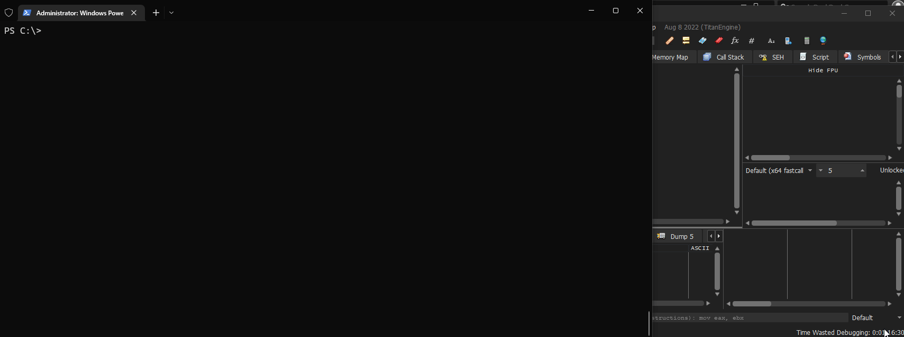

# BulletTrain

BulletTrain is an implementation of the well known PE injection technique called "Manual PE Mapping" or "Reflective PE Injection", where the PE file is manually mapped inside a process and executed from there, without need to use calls like `CreateProcess` or `LoadLibrary`, is often used to bypass Anti-Virus/Cheat solutions.

In the moment, TLS callbacks are not supported.

## How this works

It's a very simple process, but can be breakdown into the following points:

* Load PE file
* Try to allocate memory using their image base address
* Write the sections in their correct virtual addresses
* If the base address is not the prefered one (in the Optional headers), it will apply relocations into image
* Import libraries and functions by parsing IAT 
* Jump to the entrypoint :)

## Features:

- Map the whole PE inside the process (*No* PE header erasing here)
- IAT parsing 
- Relocations patches
- Works with DLLs and EXEs, as expected

## Example

Self injecting a PE file:

Injecting in another process:

Simple as that!

# Install

Go into the [releases] page and grab the executable for your platform, I tested mostly with `x64` architecture, but `x86_32` should works well.

## Usage:

Simple as:

> .\BulletTrain.exe PE_PATH PROCESS_TO_INJECT (Optional)

Notice that injection will not work with every process and will need admin privileges in order to write into another process memory.

